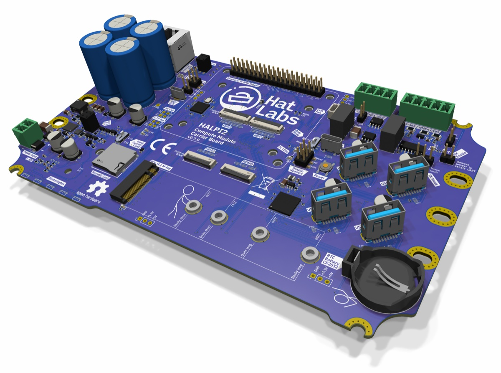
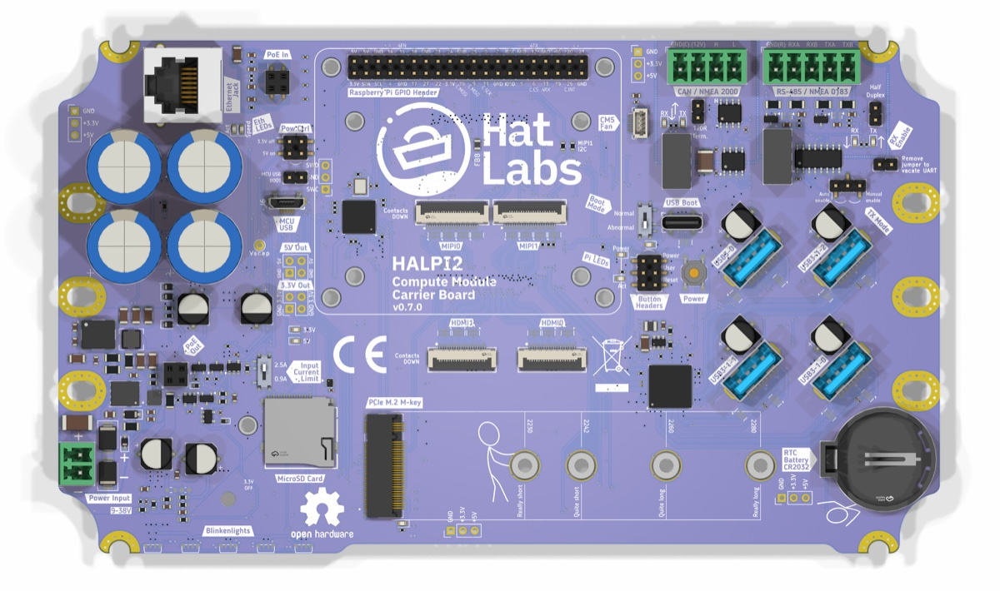
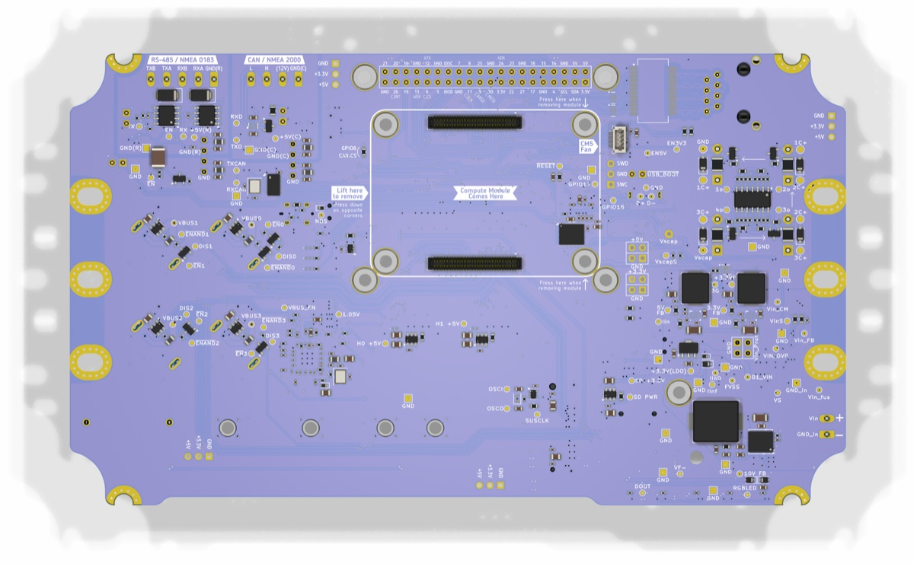

# HALPI2 Hardware

Raspberry Pi Compute Module 5 carrier board designed for marine and industrial embedded applications.

| Top | Bottom |
|-----|--------|
|  |  |

## Features

- **Power management** — Supercapacitor-backed power supply with graceful shutdown on power loss
- **RP2040 control MCU** — Manages power sequencing, watchdog, and system monitoring
- **CAN bus** — Isolated NMEA 2000 / CAN 2.0B interface
- **RS-485** — Isolated serial interface
- **USB** — USB 2.0 and USB 3.0 with onboard hub
- **Ethernet** — Gigabit Ethernet
- **HDMI** — Full-size HDMI output via FPC connection
- **PCIe / NVMe** — M.2 slot for NVMe storage
- **DSI display** — MIPI DSI connector for touchscreen displays
- **Analog monitoring** — Input voltage, supercap voltage, and input current sensing
- **RTC** — Coin cell backed real-time clock

## Design Details

- **EDA**: KiCad 9.0
- **Board revision**: v0.7.0
- **Module support**: Raspberry Pi CM5
- **License**: [CERN-OHL-S v2](https://ohwr.org/cern_ohl_s_v2.pdf)

## Related Repositories

| Repository | Description |
|------------|-------------|
| [HALPI2-firmware](https://github.com/hatlabs/HALPI2-firmware) | RP2040 embedded firmware (Rust/Embassy) |
| [HALPI2-rust-daemon](https://github.com/hatlabs/HALPI2-rust-daemon) | Linux power management daemon |
| [halpi2](https://github.com/hatlabs/halpi2) | User documentation (mdBook) |
| [HALPI2-HDMI-FPC](https://github.com/hatlabs/HALPI2-HDMI-FPC) | Impedance-controlled HDMI flexible PCB |

## Links

- [Product page](https://shop.hatlabs.fi/products/halpi2)
- [Documentation](https://docs.hatlabs.fi/halpi2)

## License

This hardware design is licensed under the [CERN Open Hardware Licence Version 2 — Strongly Reciprocal (CERN-OHL-S v2)](https://ohwr.org/cern_ohl_s_v2.pdf).
